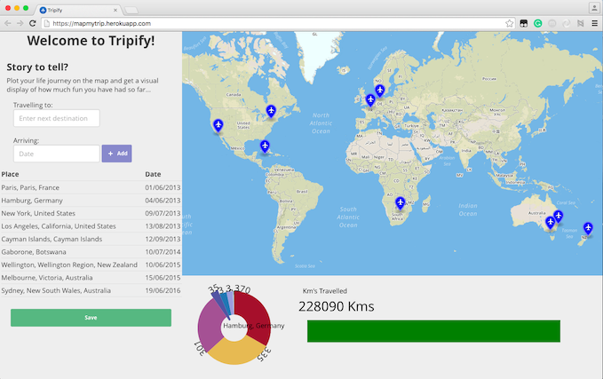

#Tripify

This is a single page web app where users can make their own interactive map of the countries they visited.
Information are stored in a PostgreSQL database and graphs a generated in the front-end with D3.js.
The backend is Ruby on Rails with AJAX calls to make it a single page app. Because I'm storing sensible information I decided to go password-less. The system will generate two different URLs, one for the user to come back and edit his trip, the second on to share with the world.
Front-end layout is made with pure CSS using Flexbox, it feature an autocomplete location search field and a date picker.We used open sourced map provided by mapbox.com API.The graphs are made with D3.js

\#RubyonRails #Javascript #AJAX #D3.js 

:link: [Live Demo](mapmytrip.herokuapp.com)

